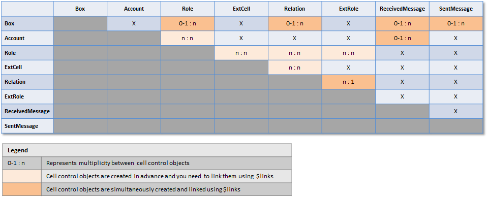

# Personium Concepts  

## Based on Standard  

Personium's API is build on international standards.  

<ul class="listStyleTypeNone">
<li>OAuth2.0 for Authorization</li>
<li>WebDAV for File operation</li>
<li>OData for relational data</li>
</ul>

## The three-layered object  
Personium is made up of the following three layer which are the basic.  
  

### Unit  
* A unit is a system infrastructure which runs Personium which have a unique FQDN.
* Since Personium adopts unique distributed architecture, it is possible to create a relationship between units and give privilege based on it.
* In a unit, it is possible to create multiple Cell.

### Cell  

* A cell is a fundamental concepts of Personium
* Each Cells are independent as if they are different tenant in multi-tenancy model.
* A Cell provides following feature  
    * Authentication and authorization
    * Access Control
    * Data Store for Applications (Box)
    * Event Processing, Messaging, Script Execution

### Box  

* A box is data store for application.
* A box can store following data.  
    * Directory
    * File Object
    * OData Data Service

### Box installation  

* It is possible to install the Box in the specified path using the bar file.
* For more details, please click <a href="./006_Box_install.md">here</a>.

### Collection  

* Collection is a data set stored in Box.
* There are the following three types.  
    * <a href="./007_WebDAV_model.html">WebDAV model</a>
    * OData model
    * Service model

### Cell control object

### Account
coming soon

### Role
coming soon

### Relation
coming soon

### ExtCell
coming soon

### ExtRole
coming soon
