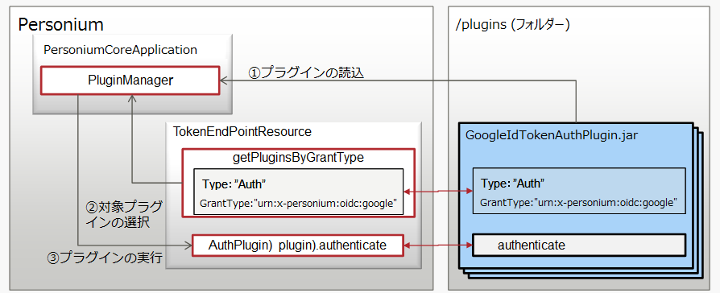
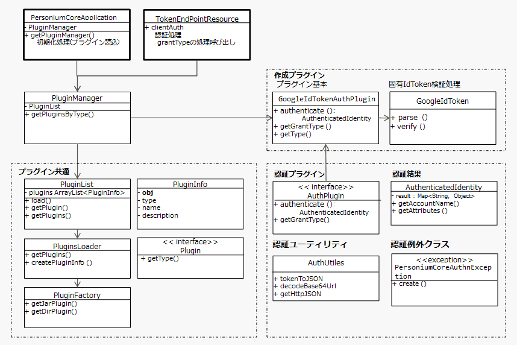
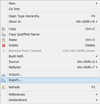
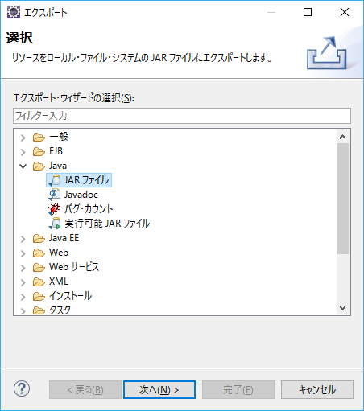
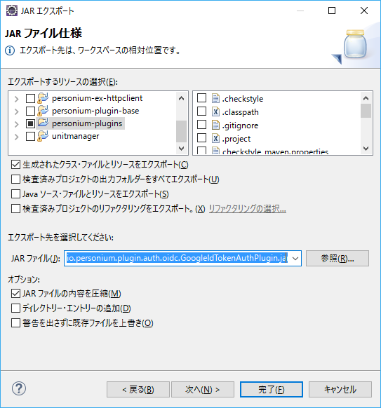
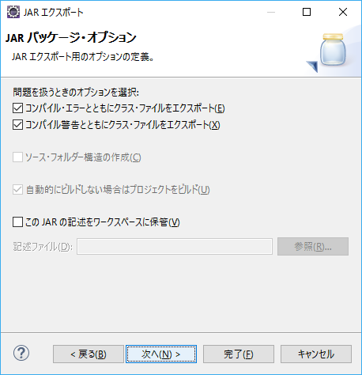
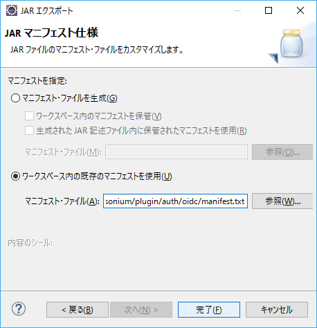

Personium Authentication Plugin Developer Manual
======

This is a document of  **Personium** Authentication Plugin Developer Manual.

Documents
------

　PersoniumのAuthentication pluginを開発する上で必要となる情報を記述しています。
　このドキュメントでは、Authentication pluginの作成手順を説明します。

## Purpose of Authentication Plugin

　Authentication pluginは、各プロバイダへの認証処理を、OpenID Connect (OIDC)の仕様に基づき、OAuth 2.0の実装を行います。

```sequence
Client->Resource Ower:(A)Authorization Request
Resource Ower-->Client:(B)Authorization Grant
Client->Authentication Server:(C)Authorization Grant
Authentication Server-->Client:(D)Access Token
Client->Resource Server:(E)Access Token
Resource Server-->Client:(F)Protected Resource
```

(A)クライアントがリソースオーナーに認可要求（Authorization Request）を出す
(B)リソースオーナーは認可要求を許諾する旨の返答として認可グラントをクライアントに送る
(C)クライアントは認可サーバーに認可グラントを送ることでアクセストークンを要求
(D)認可サーバーはクライアントの認証と認可グラントの正当性の検証を行い、問題なければアクセストークンを発行
(E)クライアントはアクセストークンにより認証を受けることで、保護されたリソースへのアクセスをリクエスト
(F)アクセストークンが正当なら、クライアントのリクエストを受入

---

　以下、google版のAuthentication Pluginを例に説明します。

## Class structure of Plugin

作成プラグインの枠線部分が作成の対象です。

Authentication Pluginのクラス構造図を以下に示します。


> **Note:**  認証処理の戻り値
> - 認証に成功した場合は、AutheticatedUserが返却されます。
> - 認証に失敗した場合は、DcCoreAuthExceptionが投げられます。

## Plugin Behavior

Authentication Pluginの動作を以下に示します。



　1. Plugin initialization processing
　    DcCoreApplicationクラスでPlugin Managerが呼出され、すべてのプラグインを読み込みます。

　2. Call authentication process
　   TokenEndPointResouceクラスで対象のGrantTypeのPluginを選択します。
　   選択したPluginのauthenticateメソッドを実行します。

> **Note:**
> - Personium Pluginは、Pluginsフォルダに配置するだけで実行可能です。
> - Authenticate Pluginは、Typeに”Auth”とGrantTypeに各プロバイダを指定し、authenticateメソッドを記述することで、対象のpluginが選択されauthenticateメソッドが実行されます。

### 1.Plugin initialization processing
####<i class="icon-file"></i>DcCoreApplication.java
```
public class DcCoreApplication extends Application {
    private static PluginManager pm;
    static {
        try {
            TransCellAccessToken.configureX509(DcCoreConfig.getX509PrivateKey(), DcCoreConfig.getX509Certificate(),
                    DcCoreConfig.getX509RootCertificate());
            LocalToken.setKeyString(DcCoreConfig.getTokenSecretKey());
            pm = new PluginManager();
        } catch (Exception e) {
            DcCoreLog.Server.FAILED_TO_START_SERVER.reason(e).writeLog();
            throw new RuntimeException(e);
        }
    }
```
　pm = new PluginManager();
　PluginManagerクラスを生成します。

---
### 2.Call authentication process
####<i class="icon-file"></i>TokenEndPointResource.java
```
            PluginManager pm = DcCoreApplication.getPluginManager();    // Plugin manager.
            PluginInfo pi = pm.getPluginsByGrantType(grantType);        // Search target plug-in.
            if (pi == null) {                                           // Plug-ins do not exist.
                throw DcCoreAuthnException.UNSUPPORTED_GRANT_TYPE.realm(this.cell.getUrl());
            }
            try {
                // Invoke the plug-in function.
                Map<String, Object> body = new HashMap<String, Object>();
                body.put(AuthConst.KEY_TOKEN, idToken);

                Object plugin = (Plugin) pi.getObj();
                AuthenticatedUser au = ((AuthPlugin) plugin).authenticate(cell, body);
                if (au != null) {
                    String account = au.getAttributes(AuthConst.KEY_ACCOUT);
                    if (account != null) {
                        // When processing is normally completed, issue a token.
                        return issueIdToken(target, dcOwner, schema, account, idToken, host);
                    }
                }
            } catch (DcCoreAuthnException e) {
                throw DcCoreAuthnException.UNSUPPORTED_GRANT_TYPE.realm(this.cell.getUrl());
            }
```
---
## Procedure for creating plugin

　以下の手順に従ってpluginを作成します。

　1. Create Java Source Program
　2. Create manifest File
　3. Export jar File
　4. Setting jar File
　5. Test & debug the Plugin

---
###  1. Create Java Source Program

　Authentication pluginのJavaのソースプログラムは、Authentication Pluginの基本となる **Authentication base plugin**と固有処理 **Authentication specific processing** の２つのプログラムファイルから構成されます。

　この２つのファイルをコピーして、**GoogleCode・google・code**と記述されているすべての部分を、これから作成するAuthentication pluginの名前に置換します。

---
Authentication base plugin
####<i class="icon-file"></i> **GoogleCodeAuthPlugin.java**
```
/**
 * personium.io
 * Copyright 2016 FUJITSU LIMITED
 *
 * Licensed under the Apache License, Version 2.0 (the "License");
 * you may not use this file except in compliance with the License.
 * You may obtain a copy of the License at
 *
 *     http://www.apache.org/licenses/LICENSE-2.0
 *
 * Unless required by applicable law or agreed to in writing, software
 * distributed under the License is distributed on an "AS IS" BASIS,
 * WITHOUT WARRANTIES OR CONDITIONS OF ANY KIND, either express or implied.
 * See the License for the specific language governing permissions and
 * limitations under the License.
 */
package io.personium.plugin.auth.google.code;

import java.util.Map;

import com.fujitsu.dc.core.DcCoreAuthnException;
import com.fujitsu.dc.core.auth.IdToken;
import com.fujitsu.dc.core.auth.OAuth2Helper.Key;
import com.fujitsu.dc.core.model.Cell;
import com.fujitsu.dc.core.plugin.auth.AuthPlugin;
import com.fujitsu.dc.core.plugin.auth.AuthConst;
import com.fujitsu.dc.core.plugin.auth.AuthenticatedUser;

public class GoogleCodeAuthPlugin implements AuthPlugin {
    /** to String. **/
    public static final String PLUGIN_TOSTRING = "Google Code Flow Authentication";

    /** urn google grantType. **/
    public static final String PLUGIN_GRANT_TYPE = "urn:x-dc1:oidc:google:code";

	/**
	 * getType.
	 * @return String
	 */
	public String getType() {
		return AuthConst.TYPE_AUTH;
	}

	/**
	 * getGrantType.
	 * @return String
	 */
	public String getGrantType() {
		return PLUGIN_GRANT_TYPE;
	}

	/**
	 * toString.
	 * @return String
	 */
	public String toString(){
        return PLUGIN_TOSTRING;
    }

	/**
	 * authenticate.
	 * @return au AuthenticatedUser
	 */
    public AuthenticatedUser authenticate(Cell cell, Map <String, Object> body){
    	AuthenticatedUser au = null;
		if (cell != null && body != null) {
	    	// check idToken
			String idToken = (String)body.get(AuthConst.KEY_TOKEN);
	    	IdToken idt = verifyIdToken(cell, idToken);

	    	// authenticate google
			au = GoogleCodeAutheticate.authenticate(cell, idt);
		}
		return au;
    }

    private IdToken verifyIdToken(Cell cell, String idToken){
       	// id_tokenのCheck処理
        if (idToken == null) {
        	throw DcCoreAuthnException.REQUIRED_PARAM_MISSING.realm(cell.getUrl()).params(Key.ID_TOKEN);
        }
        // id_tokenのパース
        IdToken idt = IdToken.parse(idToken);
        // exp で Token の有効期限切れの確認(Tokenに有効期限(exp)があるかnullチェック)

        if (idt.getExp() == null) {
        	throw DcCoreAuthnException.OIDC_INVALID_ID_TOKEN.params("ID Token expiration time null.");
        }

        // Tokenの検証。検証失敗の場合 DcCoreAuthnExceptionがthrowされる
        idt.verify();

        return idt;
    }
}
```
　IdToken検証が正常の場合は、authenticateメソッドを呼び出します。
　Authenticationが正常の場合は、AuthenticatedUserを返却します。

---
Authentication specific processing
####<i class="icon-file"></i> **GoogleCodeAutheticate.java**　
```
/**
 * personium.io
 * Copyright 2016 FUJITSU LIMITED
 *
 * Licensed under the Apache License, Version 2.0 (the "License");
 * you may not use this file except in compliance with the License.
 * You may obtain a copy of the License at
 *
 *     http://www.apache.org/licenses/LICENSE-2.0
 *
 * Unless required by applicable law or agreed to in writing, software
 * distributed under the License is distributed on an "AS IS" BASIS,
 * WITHOUT WARRANTIES OR CONDITIONS OF ANY KIND, either express or implied.
 * See the License for the specific language governing permissions and
 * limitations under the License.
 */
package io.personium.plugin.auth.google.code;

import com.fujitsu.dc.core.DcCoreAuthnException;
import com.fujitsu.dc.core.DcCoreLog;
import com.fujitsu.dc.core.auth.IdToken;
import com.fujitsu.dc.core.model.Cell;
import com.fujitsu.dc.core.odata.OEntityWrapper;
import com.fujitsu.dc.core.plugin.auth.AuthenticatedUser;
import com.fujitsu.dc.core.DcCoreConfig.OIDC;
import com.fujitsu.dc.core.auth.AuthUtils;

public class GoogleCodeAutheticate {
    /**
     * Google URL
     */
    public static final String URL_HTTPS = "https://";
    public static final String URL_ISSUER = "accounts.google.com";

    /**
     * Type値 oidc:google.
     */
    public static final String TYPE_VALUE_OIDC_GOOGLE = "oidc:google";

    /**
     * can not constructor.
     */
    private GoogleCodeAutheticate() {
    }

	/**
     * Google Authentication Process.
     * @param cell Cell
     * @param idt idToken
     * @return
     */
    public static AuthenticatedUser authenticate(Cell cell, IdToken idt) {
        String mail = idt.getEmail();
        String aud  = idt.getAudience();
        String issuer = idt.getIssuer();

        // Googleが認めたissuerであるかどうか
        if (!issuer.equals(URL_ISSUER) && !issuer.equals(URL_HTTPS + URL_ISSUER)) {
            DcCoreLog.OIDC.INVALID_ISSUER.params(issuer).writeLog();
            throw DcCoreAuthnException.OIDC_AUTHN_FAILED;
        }

        // Googleに登録したサービス/アプリのClientIDかを確認
        // DcConfigPropatiesに登録したClientIdに一致していればOK
        if (!OIDC.isGoogleClientIdTrusted(aud)) {
        	throw DcCoreAuthnException.OIDC_WRONG_AUDIENCE.params(aud);
        }

        // このユーザー名がアカウント登録されているかを確認
        // IDtokenの中に示されているAccountが存在しない場合
        OEntityWrapper idTokenUserOew = cell.getAccount(mail);
        if (idTokenUserOew == null) {
            // アカウントの存在確認に悪用されないように、失敗の旨のみのエラー応答
        	DcCoreLog.OIDC.NO_SUCH_ACCOUNT.params(mail).writeLog();
            throw DcCoreAuthnException.OIDC_AUTHN_FAILED;
        }

        // アカウントタイプがoidc:googleになっているかを確認
        // Account があるけどTypeにOidCが含まれていない
        if (!AuthUtils.getAccountType(idTokenUserOew).contains(TYPE_VALUE_OIDC_GOOGLE)){
            //アカウントの存在確認に悪用されないように、失敗の旨のみのエラー応答
            DcCoreLog.OIDC.UNSUPPORTED_ACCOUNT_GRANT_TYPE.params(TYPE_VALUE_OIDC_GOOGLE, mail).writeLog();
            throw DcCoreAuthnException.OIDC_AUTHN_FAILED;
        }

        // 正常な場合のみトークンの発行が可能
        AuthenticatedUser au = new AuthenticatedUser();
        // アカウント名の設定
        au.setAccountName(mail);

        return au;
    }
}
```
　authenticateメソッドに固有の認証処理を記述します。

---
### 2. Create Manifest File

　 **jarファイル** を生成するには、manifest.txtファイルを作成します。

#### <i class="icon-file"></i>**manifest.txt**
```
Manifest-Version: 1.0
Plugin-Class: io.personium.plugin.auth.google.code.GoogleCodeAuthPlugin
```
jarファイルを作成する情報を記述します。Plugin-Classは、package+クラス名の形式です。

---
### 3. Export jar File

####<i class="icon-file"></i>GoogleCodeAuthPlugin.jar

Eclipseを使用してjar ファイルを作成します。

1) 作成したプラグインを選択し、右クリックで表示されたメニューの「Export...」をクリックします。


2) 「Java – JAR file」を選択し、「Next >」をクリックします。


3) 作成するJarファイルのパスと名前を指定し、「Next >」をクリックします。


4) 指定せずに「Next >」をクリックします。


5) マニフィストファイルを指定し、「Finish」をクリックします。

指定したパスにJarファイルが作成されます。

---
### 4. Setting jar File
####<i class="icon-hdd"></i>dc-config.propertie
```
# general configurations
io.personium.core.plugin.path=/dc1-core/plugins
```
dc-config.propertieファイルに設定したpluginsフォルダのパスに、作成したjarファイルを配置してください。

---
### 5. Test & debug the Plugin

#### <i class="icon-file"></i>**PluginTest.java**
com.fujitsu.dc.test.core.plugin

最後のステップは、テストとデバッグです。
今回作成したプラグインをjunitでテストするには、PluginTest.javaにテスト処理のメソッドを追加します。
作成したjunitを実行して、動作が正常に終了することを確認してください。

---

  [1]: http://personium.io/
  [2]: http://personium.io/docs/
  [3]: https://github.com/personium/
  [4]: http://openid.net/
  [5]: https://oauth.net/
