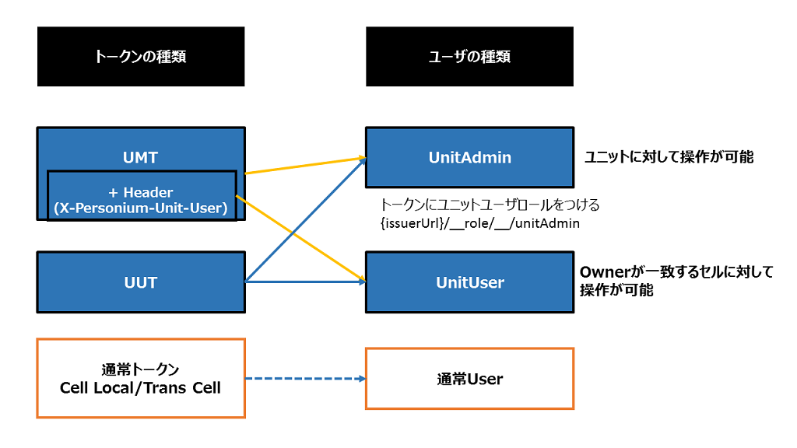

# ユニットユーザ
## ユニットユーザとは
ユニットユーザとはセルのCRUD等ユニットレベルのAPIを操作する主体のこと。  
ユニットユーザは、ユニットユーザトークン（Unit User Token (UUT)）またはユニットマスタートークン（Unit Master Token (UMT)）を用いてAPIアクセスを行う。

### ユニットユーザトークン（Unit User Token (UUT)）
UUTはPersoniumをサービスとして提供するときに大きな役割を担うが、PersoniumはUUTを使わずUMTのみを使って運用することもできる。  
サービス・プロバイダがUUTを使う最大の動機は、セルの課金先をまとめて管理することである。  
すなわち、サービス・プロバイダが自身の顧客それぞれに異なるUUTを発行し、これを使ってセル CRUD APIアクセスをしてもらうことで以下が実現する。

	・セル作成時、自身が持ち主であるという情報とともにセルが作成される。
	・セル検索時、自身が作成したセル以外は検索されない。
	・セル削除時、自身が作成したセル以外の削除は失敗する。

一方で、一つの個人・組織が自身専用ユニットを持っている場合は、そのユニットに作られるセルはすべて自身の管理となるため、上記のような機能は不要である。  
その場合はUUTのかわりにUMTを用いて運用を行っても問題はない。

ユニットユーザは識別子を持ち、それをユニットユーザ名と呼ぶ。  
ユニットはユニットユーザ名の管理機構を持たず、外部の管理機構の存在を前提とする。



## ユニットレベル制御エンティティ（セル）のオーナー属性

セルにはオーナー（owner）という隠し属性が存在する。  
隠し属性というのはOData形式のAPIから内容を確認することはできないが、すべてのセルに一つ存在する属性である。  
隠し属性の他の例としてはセル制御エンティティのaccountが挙げられる。  
accountはhashedCredentialという名前のパスワードハッシュを格納する属性が定義されている。

オーナーはセル作成時に設定したら変更は行えない。

## ユニットユーザの種類

### ユニットアドミン（Unit Admin）

ユニットに対して操作が可能なユーザ。

### ユニットユーザ（Unit User）

オーナーが一致するセルに対して操作が可能なユーザ。  
セルの検索を実施するとオーナーが一致するセルのみ検索可能。

## ユニットトークンの種類

### ユニットマスタートークン（Unit Master Token (UMT)）

ユニット内で一意のトークンで、このトークンでアクセスするとUnit Adminとして扱われる。  
personium-unit-config.propertiesの「io.personium.core.masterToken=」に任意の文字列を設定する。  
X-Personium-Unit-Userヘッダに任意の文字列を指定することで、その文字列をユニットユーザ名とするユニットユーザとして動くことも可能。

例

{UnitURL}/{UnitUserName} というユニットユーザ名をオーナーとするセル作成


```sh
curl "{UnitURL}/__ctl/Cell" -X POST \
-H "Authorization: Bearer token" \
-H "X-Personium-Unit-User: {UnitURL}/{UnitUserName}" \
-d '{"Name":"cell1"}'
```

{UnitURL}/{UnitUserName} というユニットユーザ名をオーナーとするセル一覧を取得


```sh
curl "{UnitURL}/__ctl/Cell" -X GET \
-H "Authorization: Bearer token" \
-H "X-Personium-Unit-User: {UnitURL}/{UnitUserName}"
```

### ユニットユーザトークン（Unit User Token (UUT)）

UUTは以下の情報をつめたSAML Assertionに基づくOAuth2のBearerトークンである。

|要素・属性名|内容|
|:--|:--|
|IssueInstant|認証した時刻|
|issuer|ユニットが認めたURL。<br>personium-unit-config.propertiesの「io.personium.core.unitUser.issuers=」に認める任意のURLを記述|
|Subject\NameID|	ユニットユーザ名。任意の文字列。|
|audience|ユニットルートURL|
|attribute|Unit User Role|


このトークンを発行されたアクセス主体をユニットユーザとよび、このようなSAMLアサーションを発行する認証プロセスをユニットユーザ認証と呼ぶ。

また、セルでのAccount認証でp_targetにユニットのルートURLを与えることで発行されるトランスセルトークンは、UUTの要件を満たしており、
ユニットの設定に特定のセルのURLを含めることでそのセルはUUT発行者となりうる。

例  
セルでUUTを発行する場合  
personium-unit-config.propertiesの`io.personium.core.unitUser.issuers={UnitURL}/{Cell}/`を設定


```sh
curl "{UnitURL}/{Cell}/__token" -X POST \
-d 'grant_type=password&username=user&password=pass&p_target={UnitURL}/'
```

io.personium.core.unitUser.issuers は複数URL設定可能

UUTは通常、CellのCRUD以外のアクセス権限を持っていない。  
Cellの内容を操作したい場合、後述のユニットユーザロール(CellContentsReader, CellContentsAdmin)を付与する必要がある。

### ユニットユーザロール（Unit User Role）

personium-coreはユニットユーザのロールとして以下を認識する。  
トークン内でその他のロールが付与されていたとしてもこれを認識はしない。（無視する）

#### UnitAdminロール

{UnitURL}/{Cell}/\_\_role/\_\_/UnitAdmin

UnitAdminロールが付与されている場合、そのユーザはユニットアドミンとなる。  
V0では各種ユニット管理業務にマスタートークンが乱用されたが、このような運用はセキュリティ上望ましくない。<br>
各種ユニット管理業務は、このロールのトークンを用いてAPI呼び出しを行うべきである。

#### CellContentsReaderロール

{UnitURL}/{Cell}/\_\_role/\_\_/CellContentsReader

CellContentsReaderロールが付与されている場合、そのユーザのユニットユーザトークンはCellの内容のRead権限を持つ。  

#### CellContentsAdminロール

{UnitURL}/{Cell}/\_\_role/\_\_/CellContentsAdmin

CellContentsAdminロールが付与されている場合、そのユーザのユニットユーザトークンはCellの内容のRead権限、及びWrite権限を持つ。  
ユニットユーザに"UnitAdminロール"、及び"CellContentsAdminロール"を付与することで、そのユーザのユニットユーザトークンはユニットマスタートークンと同等になる。
